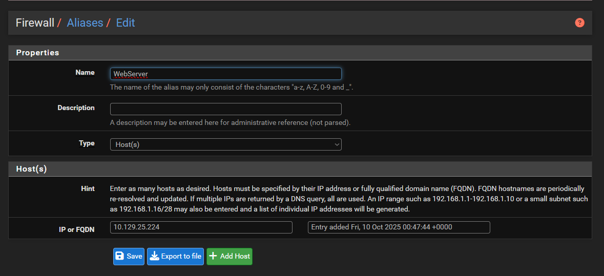

# Setting Up the Challenge Network

## Introduction

Now that we have our basic network setup, we can start configuring the actual network that we'll be attacking. It is recommended to make regular snapshots in case you mess up a config and need to rollback.

This guide will be split into several section, as such:

* Configuring Linux
* Configuring Windows
* Configuring Attacker/Firewall

## Configuring Linux

For our webserver, we'll be configuring a simple Wordpress website with some vulnerable plugins that we can attack. We'll also add and enable an FTP and SSH server on the server, to give us plenty of options for enumeration. We'll be installing the latest version of WordPress. Download and setup the server using this script

```bash
sudo dnf check-update -y
sudo dnf install wget vim tar unzip epel-release dnf-utils -y
sudo dnf install -y -y https://rpms.remirepo.net/enterprise/remi-release-9.rpm
sudo dnf install -y epel-release
# Refresh metadata
sudo dnf makecache
sudo dnf module reset php -y
sudo dnf module enable php:remi-8.3 -y
sudo dnf install -y php php-cli php-fpm php-mysqlnd php-xml php-mbstring php-json php-zip php-gd php-intl php-pecl-imagick php-opcache
sudo dnf install httpd -y
sudo dnf install -y mariadb-server
sudo systemctl enable mariadb --now
sudo mysql_secure_installation

cd /var/www/html
sudo wget https://wordpress.org/latest.tar.gz
sudo tar -xzvf latest.tar.gz
sudo rm latest.tar.gz
sudo chown -R apache:apache /var/www/html
```

For the MySQL server, we can use this [guide](https://dev.mysql.com/doc/refman/8.4/en/linux-installation-yum-repo.html). We'll change the default root password to our current "uncrackable" password ("5ecUR3\_P@ssw0rd!", its not uncrackable, but will act like one to save time on copy-pasting multiple different passwords). We'll also make a new MySQL user, which we'll call "ravin" and assign his password to be "V3ryC00lP@ssw0rd".&#x20;

```sql
CREATE DATABASE wordpress CHARACTER SET utf8mb4 COLLATE utf8mb4_unicode_ci;
CREATE USER 'ravin'@'localhost' IDENTIFIED BY "V3ryC00lP@ssw0rd";
GRANT ALL PRIVILEGES ON wordpress.* TO 'ravin'@'localhost';
FLUSH PRIVILEGES;
EXIT;
```

Also, we'll need to make a HTTPd config to serve the site.

```apacheconf
<VirtualHost *:80>
    ServerName northland.org

    DocumentRoot /var/www/html/wordpress
    <Directory /var/www/html/wordpress>
        Options FollowSymLinks
        AllowOverride All
        Require all granted
    </Directory>

    ErrorLog /var/log/httpd/error.log
    CustomLog /var/log/httpd/access.log combined
</VirtualHost>

```

Save the HTTPd config file to <mark style="color:red;">**/etc/httpd/conf.d/wordpress.conf**</mark>, and restart the service. Also don't forget to change the owner of the WordPress directory to the apache user using chmod. Navigate to http://localhost, and follow the steps to install and setup the WordPress server. Feel free to customize the WordPress site however you'd like. Since we won't be giving anyone else access to the server, we can simply leave the site as-is.&#x20;

Moving on, we can setup our vulnerabilities. For this challenge, we'll be making use of the following vulnerabilities:

* CVE-2020-25213 - A vulnerable version of File Manager which allows for unauthenticated file upload -> RCE (the initial access vector)
* Enabling XML-RPC API (basic enumeration) - Already enabled by default, no need to touch

To install File Manager, we can use WordPress's Plugins Directory and search for File Manager (or use this link [here](https://wordpress.org/plugins/wp-file-manager)). We want to install a previous version of the plugin which had the CVE, so navigate to Advanced View -> Advanced Options -> Previous Versions and select any version that is before 6.9. Once the plugin is installed, transfer it to the webserver and upload it. You may need to modify your <mark style="color:red;">**php.ini**</mark> config file to increase the maximum file upload size.&#x20;

This marks the end of the WordPress configuration. Feel free to expand on it as much as you want. Now we'll set up the vulnerable vsFTPd instance and finish setting up. For the FTP service, we'll be allowing anonymous read-only access to the FTP directory. We'll also enable logging on the FTP service so that we can collate them later on.&#x20;

Use the following script to install, and the corresponding configuration file

```bash
sudo dnf install vsftpd -y
sudo systemctl enable --now vsftpd
sudo cp /etc/vsftpd/vsftpd.conf /etc/vsftpd/vsftpd.conf.bak
sudo echo "" > /etc/vsftpd/vsftpd.conf
sudo vi /etc/vsftpd/vsftpd.conf # Use the configuration provided below

mkdir /opt/ftp
chown ftp:root /opt/ftp
chmod 755 /opt/ftp
echo "Welcome to the Northland FTP server!" > /opt/ftp/welcome.md
chmod 644 /opt/ftp/welcome.md
sudo touch /var/log/xferlog /var/log/vsftpd.log
sudo chown root:root /var/log/xferlog /var/log/vsftpd.log
sudo chmod 0644 /var/log/xferlog /var/log/vsftpd.log

sudo systemctl daemon-reload
sudo systemctl restart vsftpd
```

```editorconfig
# Listen in standalone mode
listen=YES

# Anonymous (unauthenticated) FTP access
anonymous_enable=YES

# Do NOT allow anonymous uploads or directory creation
anon_upload_enable=NO
anon_mkdir_write_enable=NO

# Do NOT allow local users to log in (optional: set to YES if you want local users)
local_enable=NO

# Disallow write commands globally (prevents STOR, DELE, RNFR/RNTO, etc.)
write_enable=NO

# Serve anonymous users from this directory
anon_root=/opt/ftp

# Passive mode settings (optional, useful for client NAT)
pasv_enable=YES
pasv_min_port=21100
pasv_max_port=21110

# Logging: enable xferlog-style logging and also verbose protocol log
xferlog_enable=YES
xferlog_file=/var/log/xferlog       # classic xferlog; default on many distros
xferlog_std_format=YES

# Additional (more verbose) protocol logging to a separate file
# To use vsftpd_log_file, xferlog_enable must be set and xferlog_std_format controls format.
# We will also enable log_ftp_protocol to capture FTP commands/replies.
log_ftp_protocol=YES
vsftpd_log_file=/var/log/vsftpd.log

# Do NOT send logs only to syslog (leave syslog_enable at default NO),
# otherwise vsftpd_log_file won't be used by itself.
syslog_enable=NO
```

You can now populate the FTP directory with any files that you want. For this demonstration, I'll be populating it with some photos of birds.&#x20;

Don't forget to update the permissions of your files after uploading them. Once you're done, shut down the server and make another snapshot to revert back to.&#x20;

<figure><figcaption><p>Hehehehehe</p></figcaption></figure>

## Configuring Windows

For Windows, there is a lot of different attacks that we can perform on Active Directory. For the sake of this guide, we'll be focusing on configuring our systems to enable the following attacks:

* Kerberoasting attacks
* DCSync
* Golden Ticket attacks
* Improperly configured shares

In addition, we'll also be adding some "confidential" files onto the systems for us to enumerate and access, as well as disabling the Windows Defender feature to save us the hassle of evading antivirus when performing the attacks. The majority of our configurations will be done on the DC.

### Configuring Exploit - Kerberoasting

The configuration to enable Kerberoasting is surprisingly easy, and will be referencing the following blogpost (linked [here](https://www.hackingarticles.in/kerberoasting-attack-in-active-directory)) for the setup steps. To start, we'll create a new user in the HR OU labelled "management"

<figure><figcaption></figcaption></figure>

<figure><figcaption></figcaption></figure>

For the management account's password, we'll be using the credentials "M@nagement999".&#x20;

<figure><figcaption></figcaption></figure>

Now, we can configure the user account to be vulnerable. Open up a command prompt or PowerShell terminal running as administrator, and copy the following command

```batch
setspn -a northland/dc.northland.org northland.org\management
```

<figure><figcaption></figcaption></figure>

This adds an SPN object to the user account, which the attacker can request a TGS from the DC for. We can repeat this step as many times as we want, adding more and more accounts to Kerberoast. For the sake of this demonstration, we'll just have one Kerberoastable account.

### Configuring Exploit - DCSync

In order for an attacker to perform a DCSync attack, they must first gain access to a compromised account with domain replication permissions. The account must have the following permissions:

* Replicating Directory Changes
* Replicating Directory Changes All

We'll create a new security group called "Replicators", grant them the aforementioned permissions, and add a user to the Replicators group. However, these configurations are hidden by default, supposedly to avoid accidental configurations by system administrators who are none the wiser. They are hidden in the "Advanced Features" view in Active Directory Users and Computers

<figure><figcaption></figcaption></figure>

Once we enable this feature, we'll be able to access a couple of new tabs, most importantly the "Security" tab, as shown here

<figure><figcaption></figcaption></figure>

We will create a new Security Group with the following settings, then right click on the domain object and select "Properties" > "Security"

<figure><figcaption></figcaption></figure>

<figure><figcaption></figcaption></figure>

Select the Replicators group (or if it is not in the list, click on "Add" and select the "Replicators" object. Scroll down in the Permissions list, and select the following permissions.

* Replicating Directory Changes
* Replicating Directory Changes All

<figure><figcaption></figcaption></figure>

Once done, click OK to confirm your changes. Finally, add the management user (or any other user you prefer) to the Replicators group.&#x20;

### Configuring Exploit - Golden Ticket

Since Golden Ticket attacks typically require the KRBTGT user's password hash, which can be obtained from the DCSync attack, this section is technically marked as done.&#x20;

### Configuring Vulnerable Shares

We'll configure a public and a development share. The public share will contain a welcome message with some default credentials to the domain, and the development share will contain confidential files (e.g. API keys, environmental variables, source code). What files to put in the development share will be left for the reader to decide.&#x20;

Earlier, we've installed the File and Storage Services role, which enables us to create network file shares and make them accessible. Create two folders labeled "Public" and "Dev" on the filesystem. In the Server Manager, select "File and Storage Services" from the sidebar, and select "Shares". Right click anywhere in the shares list, and select "New Share".&#x20;

<figure><figcaption></figcaption></figure>

<figure><figcaption></figcaption></figure>

Set the path for the share to the previously-created Public folder, and leave all other settings as default. Repeat the steps for the Dev folder. For the dev folder, we'll also add an additional configuration that will restrict access only to users in the IT OU. Back in Active Directory Users and Computers, add a new Security Group named "Dev Share Access", and add all users in the IT OU to the group. In the Permissions tab, select "Customize permissions...", and select "Add"

<figure><figcaption></figcaption></figure>

Click on "Select a principal", and search for the new security group. Leave all settings as default, and select "OK".&#x20;

<figure><figcaption></figcaption></figure>

Finally, remove the access to the universal Users security group. If you try to delete the security group now, you may face the following error message

<figure><figcaption></figcaption></figure>

To fix this, click on "Disable inheritance", and select the first options

<figure><figcaption></figcaption></figure>

Now we can apply changes and exit. Finish the configuration wizard to create the share. Now, you can add any files to the two shares, as well as your own welcome message and default credentials. Don't forget to also create some dummy users for the attacker to enumerate. For this demonstration, we'll be using this welcome message


```
Welcome to the Northland Organization! We are happy to have you here as part of our family.

To aid in your onboarding, we have assigned new accounts to you. Your username is your first name, a period and your last name (e.g. stevens.liam). The default password is configured to "W3lc0me7oN0rthLand!". 

If you encounter any issues with logging into your new account, please open a ticket or contact tech support (tech_support@northland.org)
```


<figure><figcaption></figcaption></figure>

## Configuring Firewall/Attacker

Fortunately there isn't much to configure for this section. Since we have enabled a separate interface for NAT, we can update and install new packages on the fly. We can just do a simple package update on the Kali VM to ensure we get the latest versions of our tools, as well as pull down the SecLists repository for later enumeration

```bash
sudo apt update 
sudo apt upgrade 
git clone https://github.com/danielmiessler/SecLists
sudo mv SecLists /usr/share/wordlists
```

Similarly, our firewall will have minimal configurations. We'll simply be configuring it to allow traffic to pass between our three networks. We will not configure any firewall rules to block or drop traffic from certain ports or programs.

<figure><figcaption></figcaption></figure>

<figure><figcaption></figcaption></figure>

We'll configure an NAT network that our attacker can connect to from WAN. Moving on to the firewall rules

<figure><figcaption></figcaption></figure>

<figure><figcaption></figcaption></figure>

We also enable logging on the 3 firewall rules to collect network traffic passing through. Now, we can test that the attacker is able to ping and access the Linux webserver from WAN.

<figure><figcaption></figcaption></figure>

<figure><figcaption></figcaption></figure>

Remember to take snapshots of all your virtual machines before starting the attack. Also remember to check that the Windows VMs are correctly logging activity on the host machines with Sysmon. The next section will be a short walkthrough of how to collect logs and artifacts of the attack.
