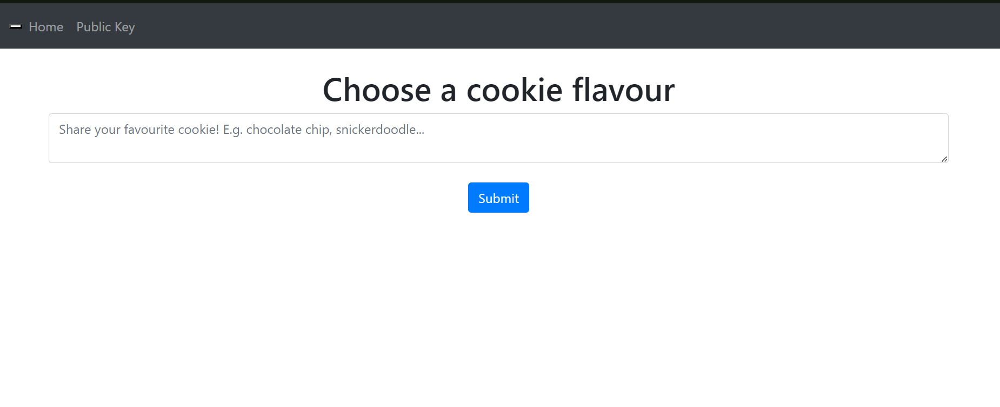

# Planning and Drafting

Before beginning a new project, it is always important to know what we want to do with the project, how we want it to look like etc.&#x20;

This is called the planning phase.

## Planning Phase

During the planning phase, I will outline my requirements for the series. My requirements will include the name of the series, the categories I want the series to cover, the difficulty range of the challenges and so on

After brainstorming for a couple of days, I come up with the following requirements:

```
Name: Sanctuary
Categories covered: Web, OSINT, Cryptography
Difficulty range: Easy - Medium
Number of challenges: 4 - 5
```

This is just a short list of requirements that I created, and this list will most likely be refined and expanded upon in future.&#x20;

If you feel that you are unable to come up with any ideas, you can take inspiration from existing challenges online.&#x20;

As an example:

* Reference challenge: [Cookies](https://medium.com/@Kamal_S/picoctf-web-exploitation-cookies-c85d0df3f1d6) (PicoCTF 2021)
* Modifications made: Used a JWT cookie instead of a plaintext cookie, added a mechanic to only output the flag when a certain value is present in the JWT cookie
* Final version: [snickerdoodles](https://github.com/IronForce-Auscent/showcase/tree/main/snickerdoodle)


<figure><figcaption><p>Final version of snickerdoodle</p></figcaption></figure>

Now that we're done with the theorycrafting stage, we can move on to the next stage: drafting!

## Drafting Phase

In the drafting phase, we will make an outline of the challenges we want to implement, how we will implement the vulnerabilities and so on.

After a bit more thinking and rubbing my two braincells together, I came up with a couple of vulnerabilities that I will use for the challenges

* SQL Injection - Easy
* Directory Traversal - Easy
* Server-Side Request Forgery (SSRF) - Medium
* Insecure Passwords - Easy / Medium

It is alright if you can only come up with one or two vulnerabilities, you can always add on to your list as you think of them. Just keep in mind that the more vulnerabilities you introduce, the more you have to be careful as you may have accidentally introduced an unintentional exploit in your code

Now, with the basic details laid out nicely, we can finally start development of the actual challenges!


Note: For the rest of this blog, I will assume that you are using [this](https://github.com/IronForce-Auscent/Sanctuary-Repository/tree/fc78be89a1371773f5ce5a9bf5a6a81e53aec13f) as the base website. I will not be covering the actual development of a website as that can be a blog in and of itself, so I highly recommend looking online for a web development guide. Once you have a website, move on to the next section
