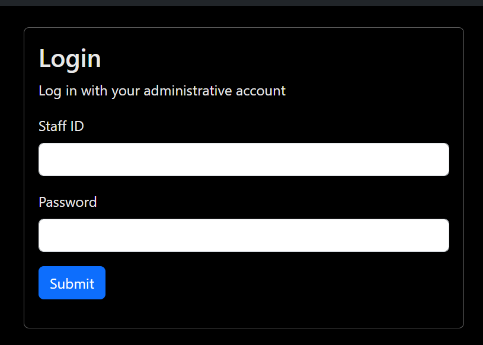

# Challenge 1: SQL Injection

Time to start with the first challenge. For this challenge, the attacker will have to exploit a poorly secured login page and access an administrator's account

### What is SQL injection?

A quick refresher in case you forgot / don't know how SQL injection works: SQL injection relies on the fact that the attacker can inject some malicious SQL code as user input and pass it directly into the backend query without being sanitized

Example of a basic SQL injection attack:


```sql
SELECT user_data FROM accounts WHERE username = ? AND password = ? -- An SQL query is evaluated from left to right
```


```
+----+----------+----------+-----------+
| ID | username | password | user_data |
+----+----------+----------+-----------+
| 1  |  admin   | 4dM1nPwD | ...       |
| 2  | john_doe | password | ...       |
+----+----------+----------+-----------+
```

When the attacker enters "admin" into the username and password field


```sql
SELECT user_data FROM accounts WHERE username = 'admin' AND password = 'admin' -- returns False
```


When the attacker enters "admin" into the username and " x' OR 1=1 -- " into the password field


```sql
SELECT user_data FROM accounts WHERE username = 'admin' AND password = 'x' OR 1=1 --' returns true since 1 is always equal to 1
```


```
2 rows affected
+----+----------+----------+-----------+
| ID | username | password | user_data |
+----+----------+----------+-----------+
| 1  |  admin   | 4dM1nPwD | ...       |
| 2  | john_doe | password | ...       |
+----+----------+----------+-----------+
```

This is the basics of how SQL injection is performed. In the later sections, we'll go through the steps to create the vulnerability and some basic processes we'll take to make it a little harder for the attacker to exploit SQL injection


### Creating the vulnerable system

We'll first create a simple login form for our user to log in with

```html



<link rel="stylesheet" href="{{ url_for('static', filename='/css/login.css') }}">


Login



<div class="card">
    <div class="card-body">
        <h3 class="card-title">Login</h3>
        <p class="card-text">
            Log in with your administrative account
            <form method="POST">
                <div class="mb-3">
                  <label for="staffid" class="form-label">Staff ID</label>
                  <input type="text" class="form-control" id="staffid" name="staffid">
                </div>
                <div class="mb-3">
                  <label for="password" class="form-label">Password</label>
                  <input type="password" class="form-control" id="password" name="password">
                </div>
                <button type="submit" class="btn btn-primary">Submit</button>
              </form>
        </p>
    </div>
</div>


<div class="alert alert-success" role="alert">
    {{ message }}
</div>

<div class="alert alert-danger" role="alert">
    {{ message }}
</div>







```

```scss
body {
    color: #1a1919;
}

.card {
    background-color: inherit;
    color: #e8e8e8;
    max-width: 40%;
    margin: auto;
    margin-top: 24px;
    border: 1px solid rgb(96, 96, 96);
}

```


<figure><figcaption><p>Perfect</p></figcaption></figure>

We can't forget the backend logic too.&#x20;

```python
# core/app.py
from .data import *

def check_login(staff_id: str, password: str) -> bool:
    connection = connect_db()
    cursor = connection.cursor()
    query = "SELECT username, type FROM accounts WHERE staffID = ? AND password = ?"
    parameters = (staff_id, password)
    cursor.execute(query, parameters)
    results = cursor.fetchall()
    return (True, results[0]) if results else (False, [])

```

```python
# core/routes.py
@app.route("/login", methods=["GET", "POST"])
def login():
    if request.method == "POST":
        staffid = request.form["staffid"]
        password = request.form["password"]
        response, results = check_login(staffid, password)
        if response:
            username, acc_type = results
            return render_template("login.html", response="success", message=f"Welcome, {username}! You are logged in as {acc_type}.")
        else:
            return render_template("login.html", response="failure", message="Invalid credentials.")
    return render_template("login.html")
```

With this, we now have a very simple login form


<figure><figcaption><p>Logging in with invalid credentials</p></figcaption></figure>

<figure><figcaption><p>Logging in with valid credentials</p></figcaption></figure>


### Implementing the vulnerability

To keep this challenge short and simple, we'll directly print out the flag along with the login confirmation message. If you wish to make a more complex challenge, you can incorporate other parts into this, such as directory traversal to find an admin-only page

Because we were using sqlite3's query parameters, this makes it significantly harder for our participants to perform SQL injection. To reduce the difficulty, we will change our query to use a format string instead

```python
# core/auth.py
from .data import *

def check_login(staff_id: str, password: str) -> bool:
    connection = connect_db()
    cursor = connection.cursor()
    query = f"SELECT username, type FROM accounts WHERE staffID = '{staff_id}' AND password = '{password}'"
    cursor.execute(query)
    results = cursor.fetchall()
    return (True, results[0]) if results else (False, [])

```

In the updated code, we have replace the original query parameters with a format string. This will remove any sanitization that may be performed before query execution.&#x20;

<figure><figcaption><p>Looks like our exploit works!</p></figcaption></figure>

It looks like the vulnerability works as expected, but wait! What if we try another staff ID (for example, Jane's staff ID)

<figure><figcaption><p>Well that doesn't look quite right</p></figcaption></figure>

If we take a look at our query, we can see what is going on


```sql
SELECT username, type FROM accounts WHERE staffID = '654321' AND password = '' OR 1=1 --'
```


When we execute this query, the database will try to match these criteria

* There is a staffID in accounts with the value "654321", and the password is ''; or
* The value of 1 is equal to 1

Since 1 is always equal to 1, therefore the statement will evaluate to true and return the following output

```sql
[(john_doe, admin), (jane_smith, user)]
```

Our code only takes the first item in the list, so it will always return the administrator account. While it looks good on paper, this will not do for our challenge. What if we have the flag in the 3rd entry of the database, then the challenge will be impossible to solve? To fix this, we have to add some parenthesis to our code to establish the order of operations

```python
...
query = f"SELECT username, type FROM accounts WHERE (staffID = '{staff_id}') AND (password = '{password}')"
...
```

Now, when we evaluate the query, the program will first check if the provided staff ID exists in the database, then check if the corresponding password is correct OR if 1 is equal to 1. Afterwards, the AND operator is then executed and the SELECT statement gives us the result

<figure><figcaption><p>Now we get our expected output!</p></figcaption></figure>

Let's up the difficulty now!

### Making the attacker's life hell

As we have mentioned previously, using sanitization will help to prevent a large majority of SQL injection techniques. This can range from simple things like removing non-alphanumeric characters, to blacklisting all SQL commands like SELECT, UNION and more.

For our challenge, we will be using two different sanitization methods:

* Whitespace stripping (removing all whitespaces)
* Simple case-sensitive input stripping (replacing matches with empty strings)

Alright, let's get to work!

```python
# core/auth.py
from .data import *

BANNED_KEYWORDS = ["SELECT", "UNION", "OR", "AND", "AS", "ORDER", "BY", "WHERE"]

def sanitize_inpt(to_sanitize: str) -> str:
    for keyword in BANNED_KEYWORDS:
        to_sanitize = to_sanitize.replace(keyword, "").replace(keyword.lower(), "")
    return to_sanitize.replace(" ", "")

def check_login(staff_id: str, password: str) -> bool:
    connection = connect_db()
    cursor = connection.cursor()
    staff_id = sanitize_inpt(staff_id)
    password = sanitize_inpt(password)
    
    try:
        query = f"SELECT username, type FROM accounts WHERE (staffID = '{staff_id}') AND (password = '{password}')"
        cursor.execute(query)
    except sqlite3.OperationalError:
        return (False, [])
    results = cursor.fetchall()
    return (True, results[0]) if results else (False, [])

```

Now, when we try our original payload, we will fail the injection. We add a try...except statement here to prevent the attacker from figuring out that their query has failed, and preventing additional data about our code from being leaked. To add additional difficulty, we even stripped away lowercase keywords (e.g. select, union, order by), so the attacker will have to be more creative with their exploits

<figure><figcaption><p>Our original input no longer works :(</p></figcaption></figure>

To exploit the form now, we will have to use some creative means of getting what we need. Lets walk through each sanitization technique and how the attacker can bypass it

* Whitespace stripping: The attacker can use multi-line comments (using the /\* and \*/ symbols) to create spaces
* Case-sensitive keyword stripping: The attacker can use a mix of upper-case and lower-case characters to call the different methods (e.g. SeLeCt instead of SELECT/select)

Testing these bypasses out, we can see that we are now able to inject the query again

<figure><figcaption><p>Using "Or" instead of "oR" will return the same result</p></figcaption></figure>

Congratulations! You have made your first web challenge.&#x20;

As a final touch, we will add some extra data into our login database, and insert the flag&#x20;

<figure><figcaption><p>Our login database</p></figcaption></figure>

Since we have the "data" column now, we have to modify our code to return the column somehow, or the flag will never be retrievable

<figure><figcaption><p>There is our first flag!</p></figcaption></figure>

Replace the flag with your CTF's flag format


### Conclusion

Congratulations, you now have a fully-fledged web challenge! In the next chapter, we will create a challenge that requires the attacker to use directory traversal to access the Foundation's secret list of safehouses, as well as some methods to prevent directory traversal attacks.

The code for this section can be found [here](https://github.com/IronForce-Auscent/Sanctuary-Repository/tree/b77c771247875073bdd7e88a8a605ce9e74f574e).
