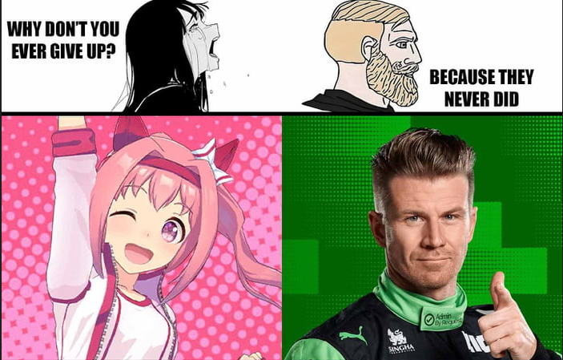
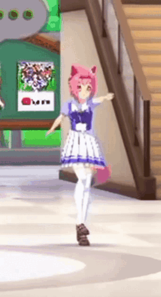

# She never gave up (Pt 1 and 2)

## Description

### Part 1


```
My gacha friends recently gotten into a new gacha game, he said its like idol training! He said he really really liked this horse, Can you find where she's retired? He only gave me this meme. wrap the place she retired in HNF25{}, all lower case.

Example: HNF25{northpoint_city}
```


Category: OSINT (Easy)

### Part 2


```
Now that we learnt that she'd retired at that place, he read online that you can actually donate ryegrass to feed her! Do you know how much grass did she receive as of now?

Wrap the numbers in HNF25{}, e.g HNF25{100000000000000000000000000000000000000000000000000000}

Note: If the number had change, open a ticket and we will work on it.
```


Category: OSINT (Easy)

## Walkthrough

We are only provided with a single image file from part 1

<figure><figcaption></figcaption></figure>

Based on the challenge name and description, it is suggested that we have to find information about the pink-haired girl in the image. For the uninitiated, this is Haru Urara, an anime character from the multi-media series "Umamusume: Pretty Derby", and also based off a racehorse of a similar name

<figure><figcaption><p>The real-life Haru Urara</p></figcaption></figure>

<details>

<summary>About Haru Urara</summary>

From the Wikipedia page of [Haru Urara](https://en.wikipedia.org/wiki/Haru_Urara)

> Haru Urara was a Japanese Thoroughbred racehorse who achieved a record of zero wins and 113 losses in a career spanning from 1998 to 2004. Her unbroken losing streak was covered by Japanese media in 2003, causing her to achieve national popularity as a symbol of perserverance and tenacity

For the four-and-a-half years after her first debut (and loss) in 17 November, 1998, Haru Urara would compete once or twice every month without winning. On June 2003, after her 80th consecutive loss, national Japanese media picked up the news of the horse, making her a household name and getting the nickname "shining star of losers everywhere" (負け組の星, _makegumi no hoshi_) for continuing to run despite her losing streak. Haru Urara ran her last race in August 2004, marking the end of her career with 0 wins and 113 losses

She was later retired in Matha Farm in 2013, where she lived until her death (9 September, 2025). During that time, she ran in a small time trial race in May 2019, meant for older horses. During this race, Haru achieved a time of 16.54 seconds and was put into first place, marking her very first win.&#x20;

On September 8, 2025, Haru became unwell and a veterinarian was called in. Overnight, her condition worsened and she passed away at Matha Farm shortly after dawn. The reported cause of death was colic

</details>

The challenge description asks for the location of Haru's retirement home. A quick Google search provides us with the relevant information

<figure><figcaption></figcaption></figure>

The second challenge asks us for the amount of (rye)grass that was donated to Haru. This is referring to a site created by an Umamusume fan, which allows fans to purchase gifts of fresh ryegrass to racehorses. The site was promoted on Twitter (now called "X"), which led to fans donating hundreds of kilograms of ryegrass and causing the site to crash at one point. The Twitter post can be found [here](https://x.com/tarutaru_mage/status/1943259707277480273?lang=en)

<figure><figcaption></figcaption></figure>

Navigating to the site, we are greeted with the following

<figure><figcaption></figcaption></figure>

We can translate the website to English using the browser's built-in translation utility (or we can just guess which value on the site it is, lol)

<figure><figcaption></figcaption></figure>

At the time of this blog post, a total of 3,540kg of ryegrass has been donated to Haru Urara.

## Conclusion

11/10 OSINT challenge series, paying homage to our favourite horse daughter. RIP Haru Urara, you will be missed

<figure><figcaption></figcaption></figure>
