# File Shield

## Challenge Description


```
Your mission is to infiltrate the File Shield application, bypass its security layers, and locate the flag hidden within its file-hosting system. The app uses next-gen security technologies that you’ll need to find ways to exploit in order to access the secret flag.

Hosted: <Challenge URL>
```


Category: Web Security (Medium)

## Walkthrough

When navigating to the challenge URL, we are provided with the following page

<figure>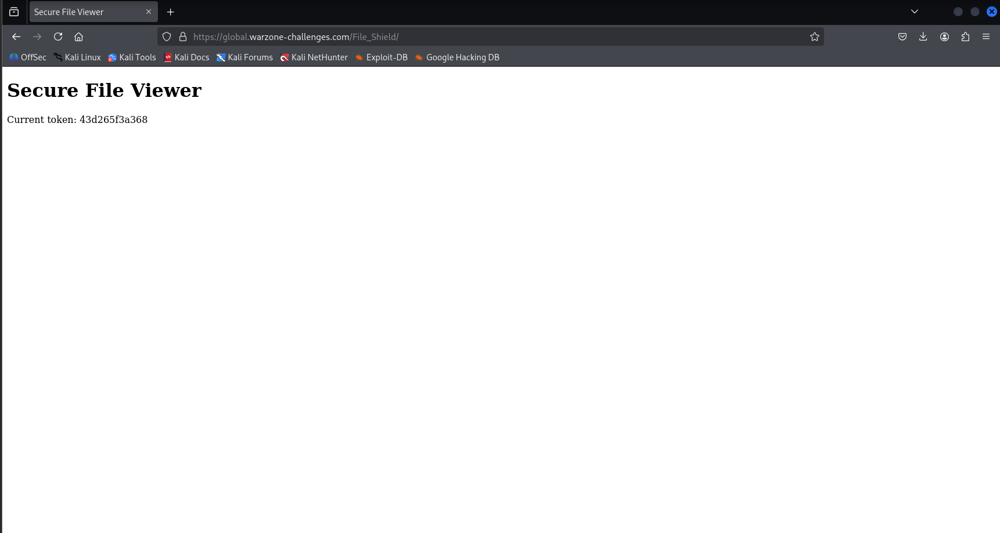<figcaption></figcaption></figure>

Looks very empty, the current token seems to be randomized and have no real significance. We can use Ffuf to enumerate for other directories, of which only one appears

<figure>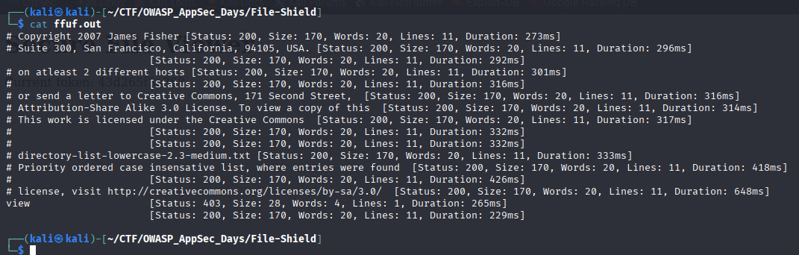<figcaption></figcaption></figure>

<figure>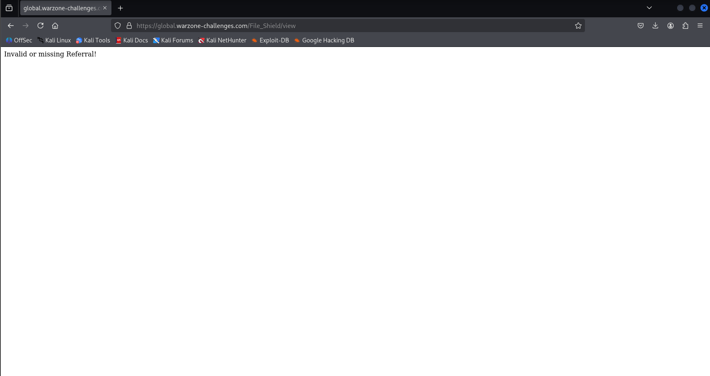<figcaption></figcaption></figure>

Hmm, maybe we should open this in Burpsuite

<figure>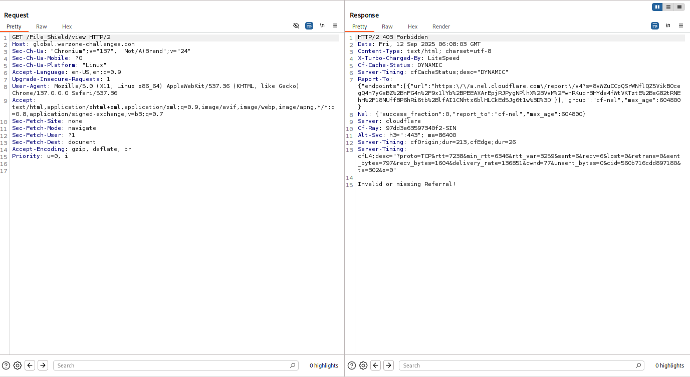<figcaption></figcaption></figure>

We can add a Referral header, which should let us access the rest of the site. Just to be safe, we set the referral address to the server's localhost address.

<figure>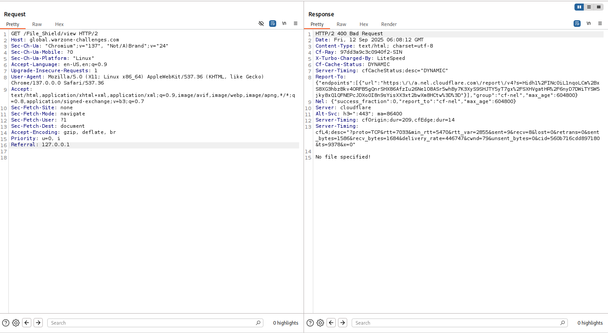<figcaption></figcaption></figure>

Nice! We get a different response now, prompting for a file name. Just to test the waters, lets add a file parameter in the GET request, and request for index.html

<figure>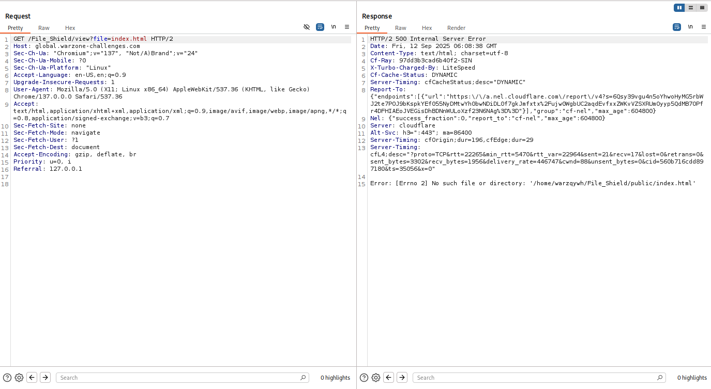<figcaption></figcaption></figure>

Hmm, we now know where the website is located, but we cant seem to access the document. Thinking that maybe there's a path traversal vulnerability, lets try accessing /etc/passwd

<figure><figcaption></figcaption></figure>

Hmm, there seems to be some form of protection against accessing the file. Just to be certain, I tried accessing /etc/hosts too, which is located in the same directory as the previous file

<figure>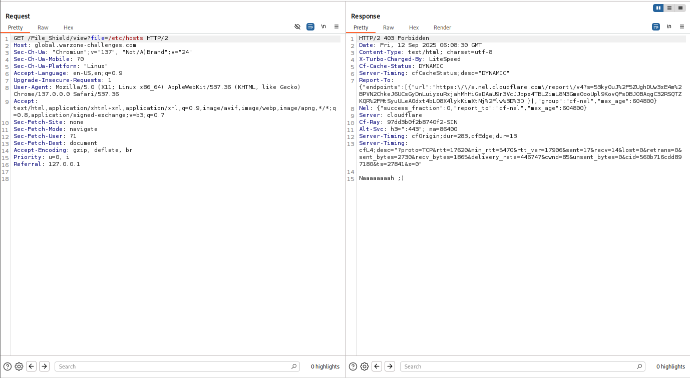<figcaption></figcaption></figure>

Yep, nothing too.

At this point, I started enumerating the blacklist, to see what values are accepted and blocked. From my attempts, I found the following information about the blacklist

* It will detect for the presence of the forward slash key (/) and return an error
* It will attempt to URL decode the provided filename first before doing the above

<details>

<summary>Tested values and their results</summary>

<div><figure>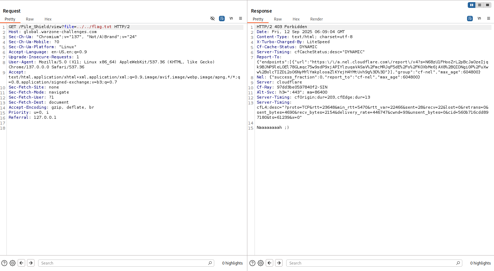<figcaption></figcaption></figure> <figure><figcaption></figcaption></figure> <figure>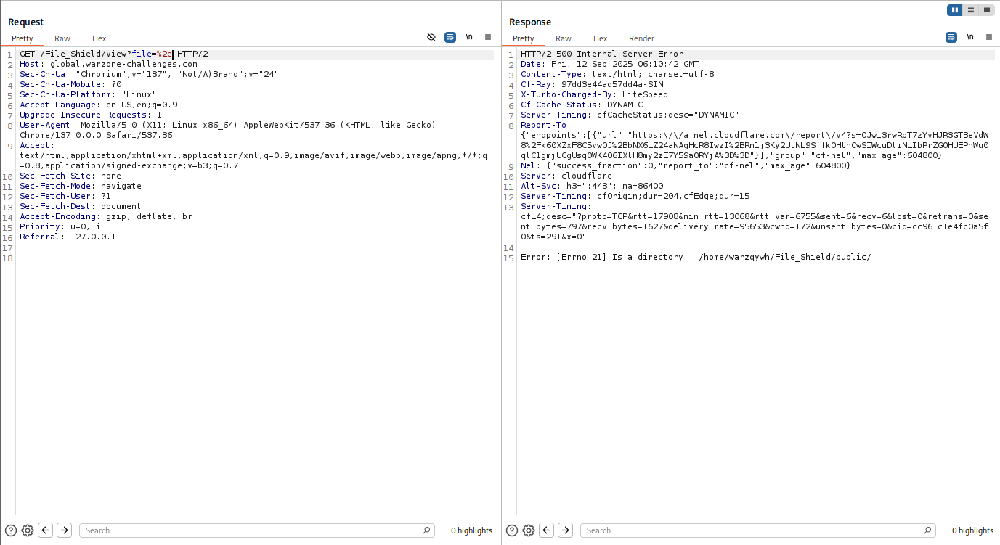<figcaption></figcaption></figure> <figure>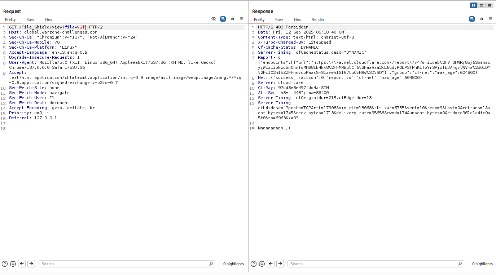<figcaption></figcaption></figure></div>

</details>

It seems like we need to double-encode our values befoer we pass them to the server. Thankfully, that seemed to do the trick.

<figure>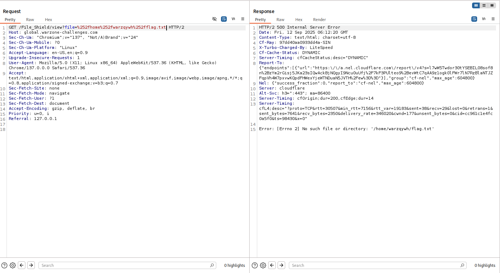<figcaption></figcaption></figure>

Now we just need to do a little searching around, and we find our flag file in no time!

<figure>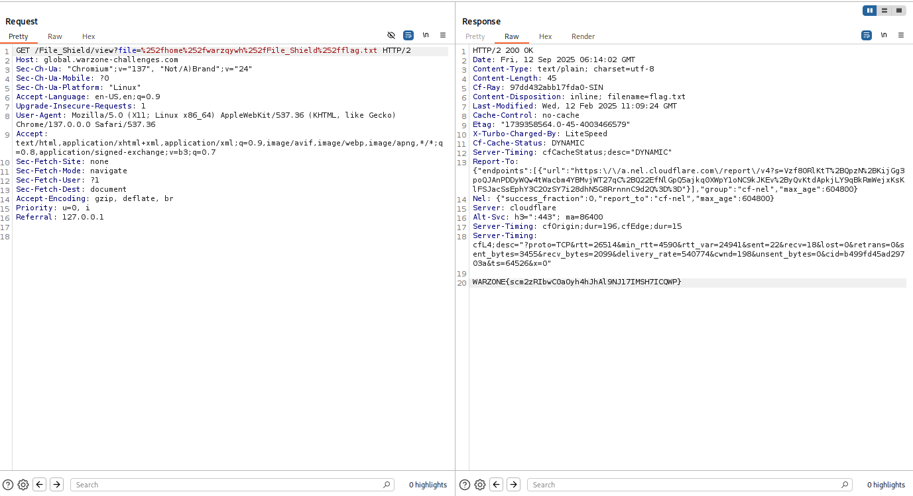<figcaption></figcaption></figure>

## Conclusion

This was a pretty fun web challenge, I haven't encountered a path traversal challenge before that required the use of double URL encoding the parameter to bypass the blacklist.
