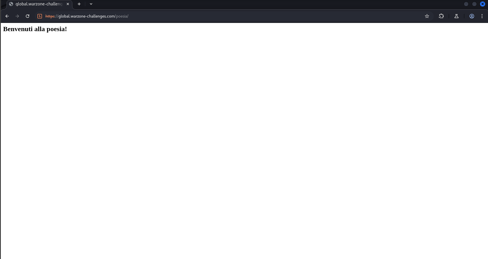
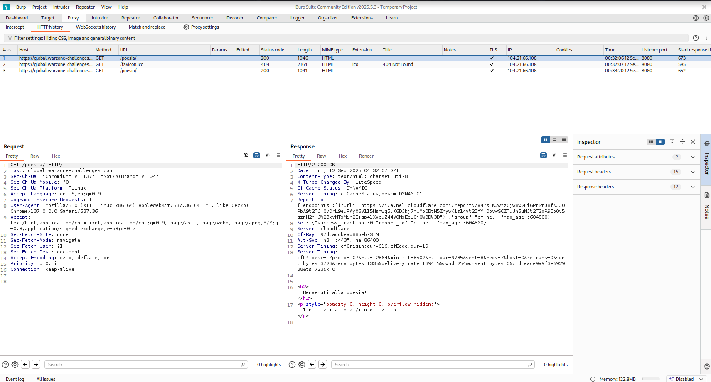
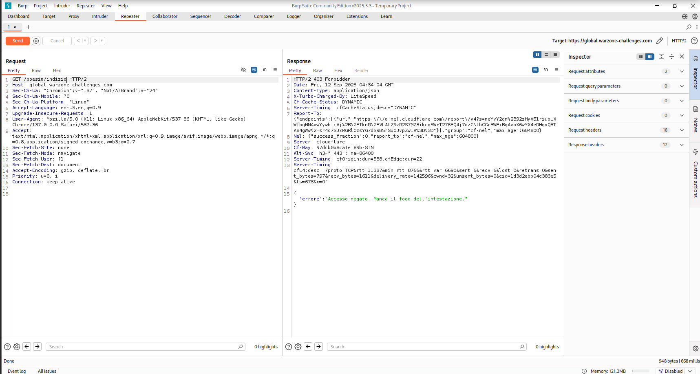
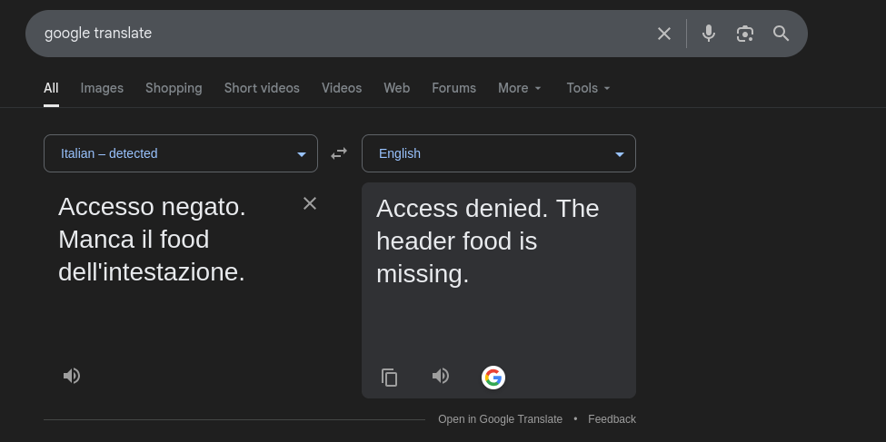
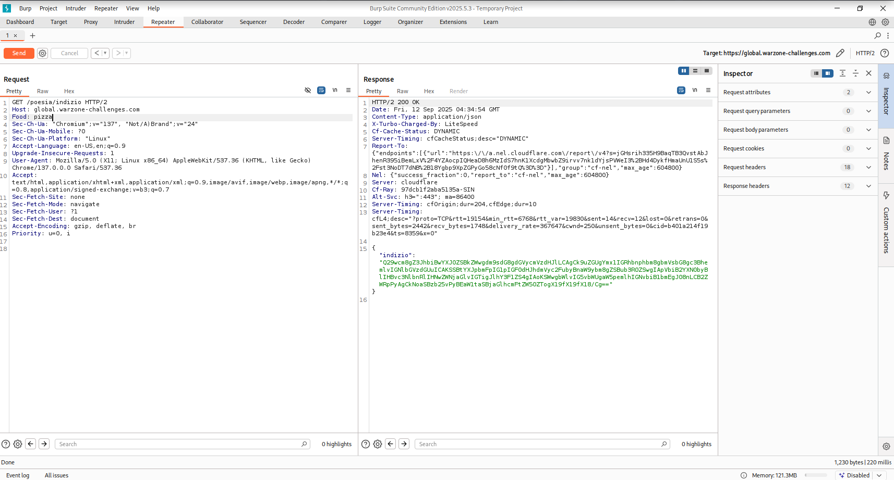
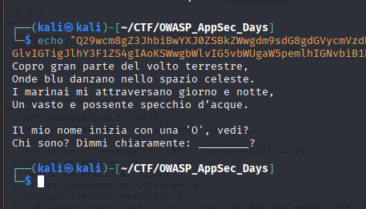
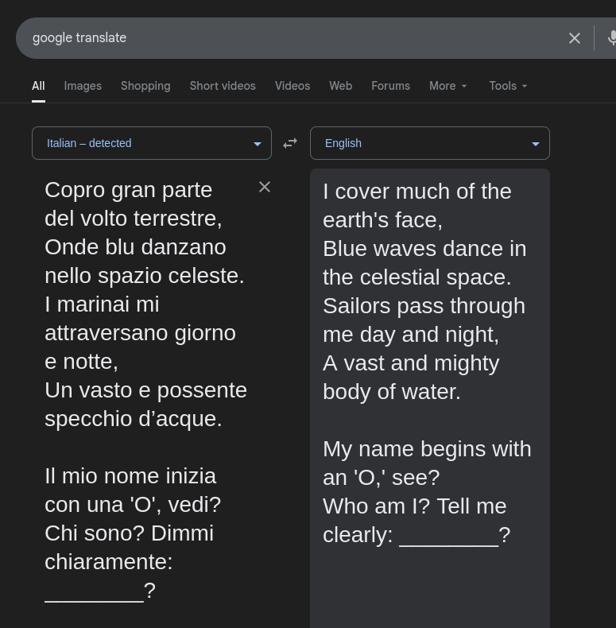
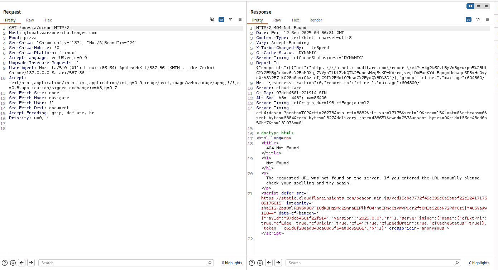
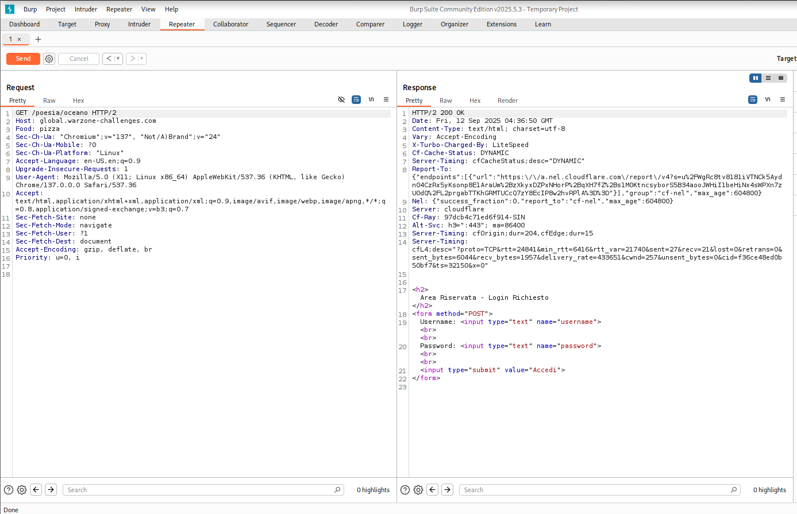
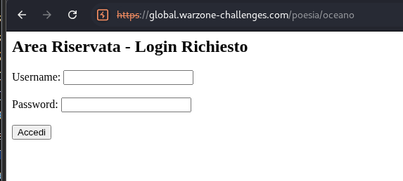

# Poesia

## Challenge Description


```
My 17 year old nephew, who lives in Italy and has a curiosity for old poetry, created a website for me as a kind of puzzle. Knowing I'm into computers, he challenged me to find the secret hidden within it.

Target: <CHALLENGE URL>
```


Category: Web Security (Medium)

## Walkthrough

When we navigate to the URL provided, we are met with the following webpage

<figure><figcaption></figcaption></figure>

The webpage is largely empty and uninteresting, with the exception of a zero-width line in the source code

<figure><figcaption></figcaption></figure>

Based on the wording, it suggests that we have to navigate to /indizio (which I learnt later was Italian for "clue" TIL). Navigating to the endpoint returns the following result

<figure><figcaption></figcaption></figure>

Looks like an API endpoint. Translating the text with Google Translate returns "Access denied. The header food is missing"

<figure><figcaption></figcaption></figure>

Simple enough. Lets add a request header named "food" and give it a value. This part took a bit of experimentation, as you need to provide a specific value in order for the second part to appear.&#x20;

<figure><figcaption></figcaption></figure>

<figure><figcaption></figcaption></figure>

Second stage appears to be a riddle. Google Translate to the rescue again!

<figure><figcaption></figcaption></figure>

The answer is obviously "Ocean". From here, I was stuck for about 15 minutes while I figured out how to use the value provided. I first attempted changing the value in the food header to ocean, then the Italian translation for ocean. After a while, I finally figured out that you have to navigate to an endpoint with the same name (in Italian, as I found out too)

<figure><figcaption></figcaption></figure>

<figure><figcaption></figcaption></figure>

<figure><figcaption></figcaption></figure>

Looks very custom-made, maybe it'll be vulnerable to SQL injection

<figure><figcaption></figcaption></figure>

<figure><figcaption><p>It was, in fact, vulnerable to SQL injection</p></figcaption></figure>

## Conclusion

Pretty simple web challenge, felt like it was more gamified than realistic, but points is points
