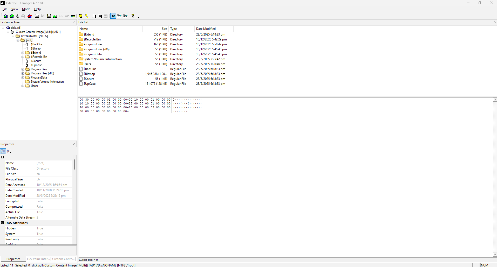

# Traveling Intern 4

## Description

```
Refer to the assignment brief for details and objective
```

Assignment Brief:


```
Thanks to you, we were able to track down the party just before they left Shanghai. Our agent was able to recover the intern’s laptop after he left it unlocked at a café and created a snapshot of the disk for forensics analysis later.

Your prior performance has caught the attention of higher-ups, and they have requested for you to take on this assignment to analyze the disk image. Have a look at the provided artifact and see if you can find anything interesting in the intern’s laptop that we can use.

You may download the disk artifact from the following link: https://drive.google.com/file/d/1kMXZ6q6wp0K2UV7oL1WLeojOsvjUY0xw/view?usp=sharing 
```


## Walkthrough

This time, we've been given a different objective. We're tasked with downloading the disk image, and perform forensics on it. We can open the AD1 disk image in FTK Imager and see what we're working with.

<figure><figcaption></figcaption></figure>

Looking at the filesystem, we can safely determine that this is a Windows filesystem, evident by the Program Files directories. We can start our investigation by checking the individual user directories.

<figure><figcaption></figcaption></figure>

Looks like the Solitude user's downloads folder has an interesting file. The .kdbx file extension indicates that this is a KeePass database, which is a local password manager. There is a chance that there are credentials stored in the database, so we can try to extract them. We can right click on the file and click Export Files to save them to our host filesystem.&#x20;

<figure><figcaption></figcaption></figure>

Unfortunate, looks like the database is protected with a master password. We can try to look around Solitude's directories to see if the password is hidden somewhere. We can try to check their browser history first, in case it contains any useful information.&#x20;

<figure><figcaption></figcaption></figure>

It looks like the user has Firefox installed, which stores its application data in the file path shown above. Search history is typically stored in places.sqlite, so we can export that database and open it up in a DB browser of our choosing.

<figure><figcaption></figcaption></figure>

Browsing history is stored in the <mark style="color:red;">**moz\_places**</mark> table, which we can view by select Browse Data -> Table: <mark style="color:red;">**moz\_places**</mark>.

<figure><figcaption></figcaption></figure>

Looks like there are a couple of Pastebins referencing the ICA, maybe they contain some useful information. We can copy the URLs in the database, and navigate to them in our web browser.&#x20;

<figure><figcaption></figcaption></figure>

Looks like both Pastebins are password protected again. We can try using the previous password that we got in Traveling Intern 3 to unlock the pastes.

<figure><figcaption></figcaption></figure>

<figure><figcaption></figcaption></figure>

Looks like the password was successful, and we were able to get the KeePass password. Lets use it to unlock the database, and see what it contains.

<figure><figcaption></figcaption></figure>

The password was correct, and we unlocked the database. We also get our flag in the database as well.

<figure><figcaption></figcaption></figure>

## Creator's Notes

I had originally wanted to make the final challenge a disk forensics and malware analysis investigation, but unfortunately did not have time or motivation to figure it out.&#x20;

This challenge series was a pleasure to develop, since it didn't take much effort to do and lets me implement roleplay mechanics into my challenges.&#x20;

Edit: After interviewing some of the winners, I found out that there is an unintended solve for this challenge. When investigating the user's Firefox application data folder, you will come across a <mark style="color:red;">**logins.db**</mark> file. This file is encrypted, but you can decrypt it using [firepwd](https://github.com/lclevy/firepwd), which will yield you the password to decrypt the bins. The screenshot below demonstrates the unintended method to get the password, assuming you did not find the intern's Instagram account.

<figure><figcaption></figcaption></figure>

After exporting both the <mark style="color:red;">**logins.json**</mark> and <mark style="color:red;">**key4.db**</mark> files, we can run the <mark style="color:red;">**firepwd.py**</mark> script and decrypt the login credentials file. The reason this is possible is because the decryption key and salts for <mark style="color:red;">**logins.json**</mark> is stored in the <mark style="color:red;">**key4.db**</mark> file. As such, after extracting the encryption information, we can just decrypt the credentials directly. Credit goes to Discord user jeff\_160 for discovering this unintended solve.&#x20;
